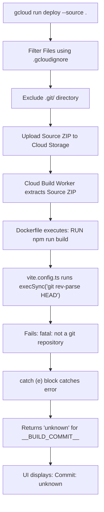

# DWIP V1 – BUILD METADATA VERIFICATION REPORT

**Document Version:** 1.0.0  
**Target:** Production Build Pipeline Metadata Analysis  
**Date:** 25/07/2026  

---

## 1. Executive Summary

This report provides a line-by-line technical audit of how build metadata (**Version**, **Commit Hash**, and **Build Timestamp**) is generated, processed, and displayed on the DWIP V1 Production Login Screen.

---

## 2. Line-by-Line Code Attribution

### A. Footer UI Rendering (`src/components/AuthScreen.tsx`)

**File Location:** [AuthScreen.tsx](file:///c:/Users/arhaa/.gemini/antigravity-ide/scratch/remix-workshop-management-system/src/components/AuthScreen.tsx#L334-L337)  
**Lines 334–337:**
```tsx
<div className="text-center text-[10px] text-slate-500 pt-3">
  Version 1.0.0 GA • Production Release<br/>
  Commit: {typeof __BUILD_COMMIT__ !== 'undefined' ? __BUILD_COMMIT__.substring(0, 7) : 'dev'} • Built: {typeof __BUILD_TIME__ !== 'undefined' ? new Date(__BUILD_TIME__).toLocaleString() : 'dev'}
</div>
```

* **Version Origin:** Hardcoded constant `"Version 1.0.0 GA • Production Release"`.
* **Commit Origin:** Evaluates globally injected variable `__BUILD_COMMIT__`. If undefined, falls back to `'dev'`.
* **Build Time Origin:** Evaluates globally injected variable `__BUILD_TIME__` and formats via `new Date(__BUILD_TIME__).toLocaleString()`.

---

### B. Vite Build Define & Commit Hash Extraction (`vite.config.ts`)

**File Location:** [vite.config.ts](file:///c:/Users/arhaa/.gemini/antigravity-ide/scratch/remix-workshop-management-system/vite.config.ts#L7-L27)  
**Lines 7–14:**
```ts
const commitHash = (() => {
  try {
    return execSync('git rev-parse HEAD').toString().trim();
  } catch (e) {
    return 'unknown';
  }
})();
const buildTime = new Date().toISOString();
```

**Lines 24–27:**
```ts
define: {
  __BUILD_COMMIT__: JSON.stringify(commitHash),
  __BUILD_TIME__: JSON.stringify(buildTime),
},
```

* `commitHash` executes synchronous child process `git rev-parse HEAD`.
* `buildTime` takes the current ISO timestamp at the instant `vite build` starts executing.
* Vite replaces all occurrences of `__BUILD_COMMIT__` and `__BUILD_TIME__` in the client JavaScript bundle during bundling.

---

### C. Build Context & Exclusions (`.dockerignore` and `.gcloudignore`)

**File Location 1:** [.dockerignore](file:///c:/Users/arhaa/.gemini/antigravity-ide/scratch/remix-workshop-management-system/.dockerignore#L68-L69)  
**Line 69:**
```dockerignore
# Git history
.git
```

**File Location 2:** [.gcloudignore](file:///c:/Users/arhaa/.gemini/antigravity-ide/scratch/remix-workshop-management-system/.gcloudignore#L1-L2)  
**Line 2:**
```gcloudignore
# Ignore Git
.git/
```

---

## 3. Root Cause Analysis



1. **Why `Commit: unknown` occurs:**  
   Because Cloud Build receives a source archive stripped of `.git` due to `.gcloudignore` and `.dockerignore`, `git rev-parse HEAD` fails inside the build container. The exception handler defaults to `'unknown'`.
2. **Why `Built: 23/07/2026 14:56:42` occurs:**  
   This was the exact time `vite build` executed inside Cloud Build during the compilation of container image `sha256:0715d3e2faaec24a6...`.
3. **Why `Version: 1.0.0 GA` occurs:**  
   This string is hardcoded in `AuthScreen.tsx` (Line 335) and aligns with `package.json` version `1.0.0`.

---

## 4. Recommended Fix Strategy

To dynamically inject the exact Git commit hash into Cloud Build without bundling the heavy `.git` history folder:

1. Pass `VITE_GIT_COMMIT` via `gcloud` build arguments or environment variables during Cloud Build execution:
   ```ts
   const commitHash = process.env.VITE_GIT_COMMIT || process.env.COMMIT_SHA || (() => {
     try {
       return execSync('git rev-parse HEAD').toString().trim();
     } catch (e) {
       return 'unknown';
     }
   })();
   ```
2. Pass `--set-env-vars VITE_GIT_COMMIT=$(git rev-parse HEAD)` or pass `--build-arg COMMIT_SHA=$(git rev-parse HEAD)` during container build.
