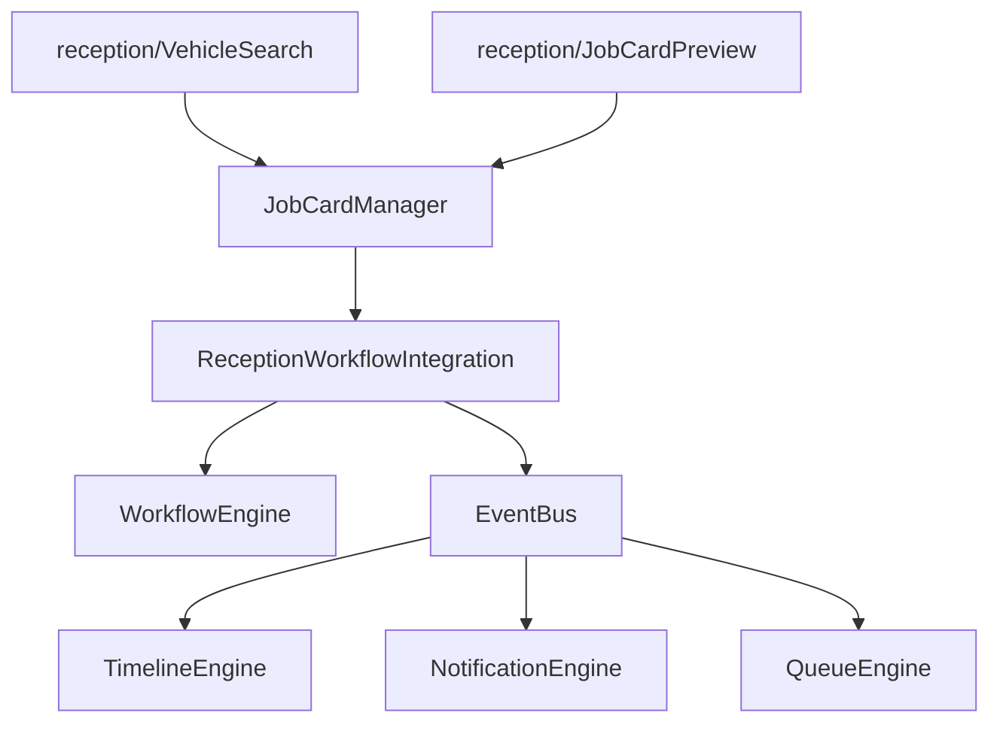

# Reception Module Architecture

This document details the architectural layout, modules, and bounded context integrations of the Reception module in the Devanand Workshop Management System (DWIP).

## Component Hierarchy

## Core Modules & Roles

1. **`VehicleSearch`**: Enables looking up vehicles, active recall campaigns, repeat rework complaints, and Field Service Bulletins (FSB).
2. **`JobCardManager`**: Interactive registration panel. Handles camera scans for VRN plates & odometer readings, voice transcription, and Gemma-4 form predictions.
3. **`JobCardPreview`**: Compiles draft form inputs into a beautiful pre-check-in slip overlay. Highlights AI predictions, TAT estimation, suggested bays, and override logs.

## Decoupled Event Flow

All reception actions publish events asynchronously on the `EventBus` to update internal state engines:
- **`VEHICLE_RECEIVED`**: Initiates check-in sequence.
- **`JOB_CARD_CREATED`**: Triggers transition to `GATE_IN` then `INTAKE_PENDING` in the SLA/Workflow Engine.
- **`QUEUE_UPDATED`**: Promotes vehicle to the correct queue.
- **`TIMELINE_APPENDED`**: Logs audit trails on the timeline.
