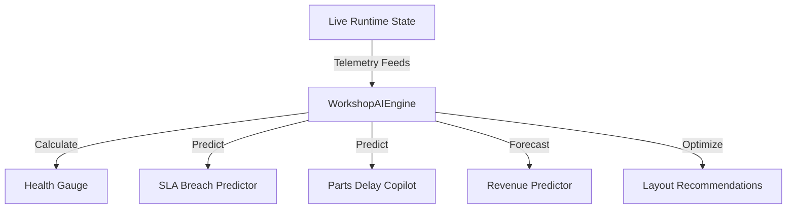

# Workshop AI Architecture

This document describes the architectural layout of the **AI Operations Center** within the Devanand Workshop Management System (DWIP).

## 1. Copilots Design & Data Flow
- **WorkshopAIEngine**: Centralizes analytical logic calculations. Decoupled from React lifecycle for speed and memory efficiency.
- **Dynamic Updates**: Recalculates metrics every time the underlying job card or bay roster array changes (`useMemo` wrappers).
- **Zero Blockage**: Non-blocking calculations keep client performance stable.
