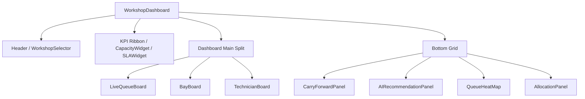

# Workshop Manager Component Map

This document outlines the visual component hierarchy of the **Workshop Manager Module** under `src/components/workshop-manager/`.

## Component Hierarchy Diagram

## Component Breakdown & Descriptions

### 1. `WorkshopDashboard` (Main Entry)
- **Role**: Coordinates the overall layout, connects to state providers, and manages the global theme.
- **Visuals**: Full screen dark-mode optimized canvas with active glassmorphism tiles.

### 2. `Header` & `WorkshopSelector`
- **Role**: Displays workshop details (name, active shift, connection status) and allows switching between Kalaburagi, Gulbarga, Basavakalyan, and Shahapur locations.

### 3. `LiveQueueBoard`
- **Role**: Displays vehicles grouped by current workshop queue (Gate, Reception, Advisor, Workshop, QC, Parts, Billing).

### 4. `BayBoard`
- **Role**: Grid displaying the 12 workshop bays. Displays active technician, vehicle details, current phase elapsed time, and ETA warning icons.

### 5. `TechnicianBoard`
- **Role**: Tracks active roster technicians. Highlights their current state (Idle, Working, Paused, On Leave), current job loads, and daily productivity rating.

### 6. `QueueHeatMap`
- **Role**: Color-coded visualization showing load spikes and bottlenecks across stages to identify where vehicles are getting stuck.

### 7. `SLAWidget` & `CapacityWidget`
- **Role**: Live count of active SLA threats (e.g. jobs approaching ETD limit within 15 minutes) and shop capacity stats.

### 8. `AllocationPanel`
- **Role**: Control sheet triggered when clicking a bay or queue item to reassign technicians or bays.

### 9. `AIRecommendationPanel`
- **Role**: Summarizes Gemma-4 system-wide optimization tips, allowing the manager to batch-apply suggestions.

### 10. `CarryForwardPanel`
- **Role**: Lists carry-forward and rework jobs requiring direct manager approval or override authorization.
