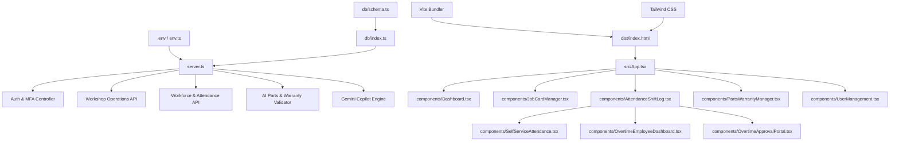

# DWIP V1 Dependency Graph

This document details the modular structure, third-party libraries, and internal import hierarchy of the Remix Workshop Management System.

---

## 1. Third-Party Dependencies (`package.json`)

The application architecture utilizes the following external libraries:

```
wms-workforce (v1.0.0-rc1)
├── Production Stack
│   ├── express (v4.21.2)           --> REST Routing and API Controller
│   ├── mysql2 (v3.22.5)            --> Connector pool for MySQL (Cloud SQL)
│   ├── drizzle-orm (v0.45.2)        --> Schema maps and ORM queries
│   ├── jsonwebtoken (v9.0.3)        --> Token generation, signature and validation
│   ├── bcryptjs (v3.0.3)            --> Secure password hashing algorithm
│   ├── @google/genai (v2.4.0)       --> Gemini Developer API Connector
│   └── dotenv (v17.2.3)             --> Config loader mapping environment vars
├── Frontend Stack
│   ├── react (v19.0.1)              --> Client layout library
│   ├── react-dom (v19.0.1)          --> View renderer
│   ├── recharts (v3.9.0)            --> Business charts and line plots
│   └── lucide-react (v0.546.0)      --> SVG icon sets
└── Build Engine
    ├── vite (v6.2.3)                --> Clients bundler and compiler
    ├── esbuild (v0.25.0)            --> Fast server compilation
    └── typescript (v5.8.2)          --> Types validations compiler
```

---

## 2. Internal Imports & Code Architecture

The logical data-flow is mapped as follows:


