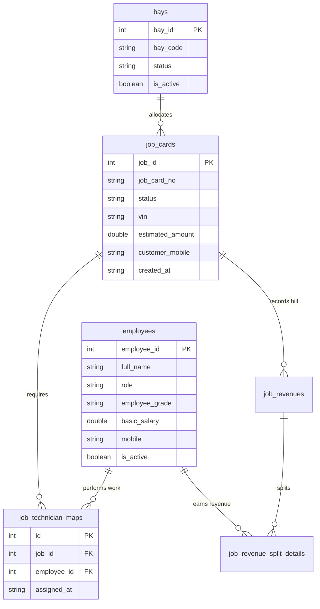

# DWIP Entity-Relationship Diagram
**Database Schema Visual Mapping**

```mermaid
erDiagram
  employees ||--o{ job_technician_maps : "performs work"
  job_cards ||--o{ job_technician_maps : "requires"
  bays ||--o{ job_cards : "allocates"
  job_cards ||--o{ job_revenues : "records bill"
  job_revenues ||--o{ job_revenue_split_details : "splits"
  employees ||--o{ job_revenue_split_details : "earns revenue"
  
  employees {
    int employee_id PK
    string full_name
    string role
    string employee_grade
    double basic_salary
    string mobile
    boolean is_active
  }
  
  job_cards {
    int job_id PK
    string job_card_no
    string status
    string vin
    double estimated_amount
    string customer_mobile
    string created_at
  }
  
  bays {
    int bay_id PK
    string bay_code
    string status
    boolean is_active
  }
  
  job_technician_maps {
    int id PK
    int job_id FK
    int employee_id FK
    string assigned_at
  }
```
