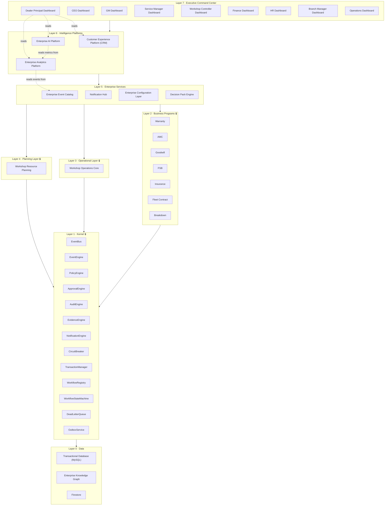
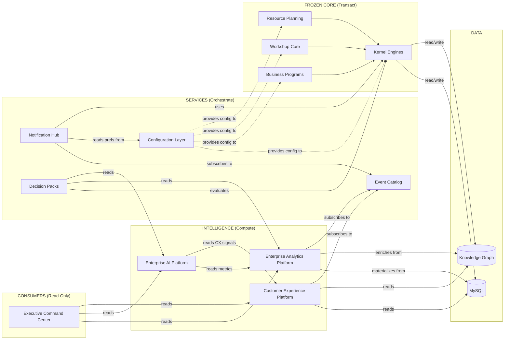
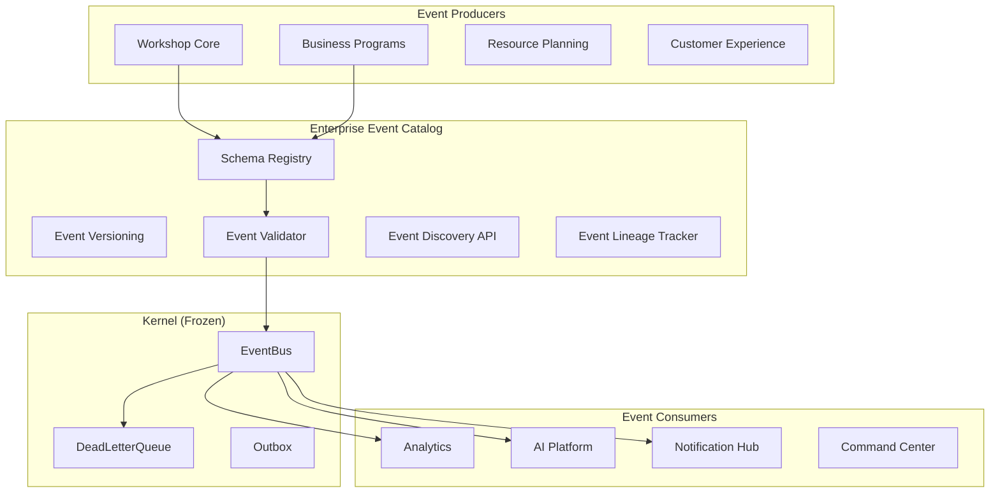
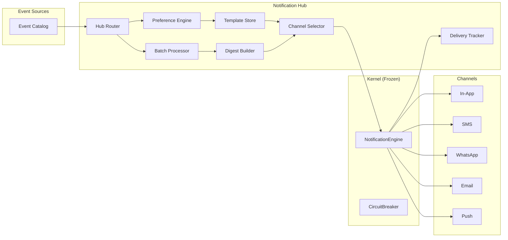
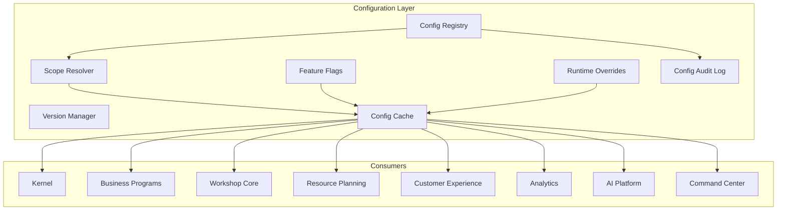
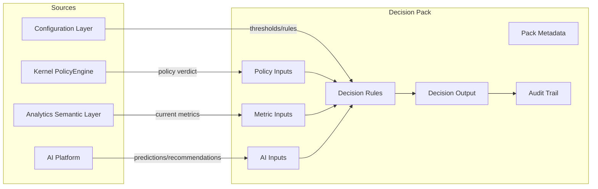
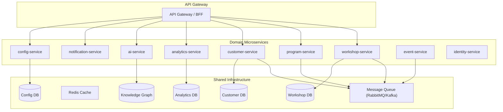
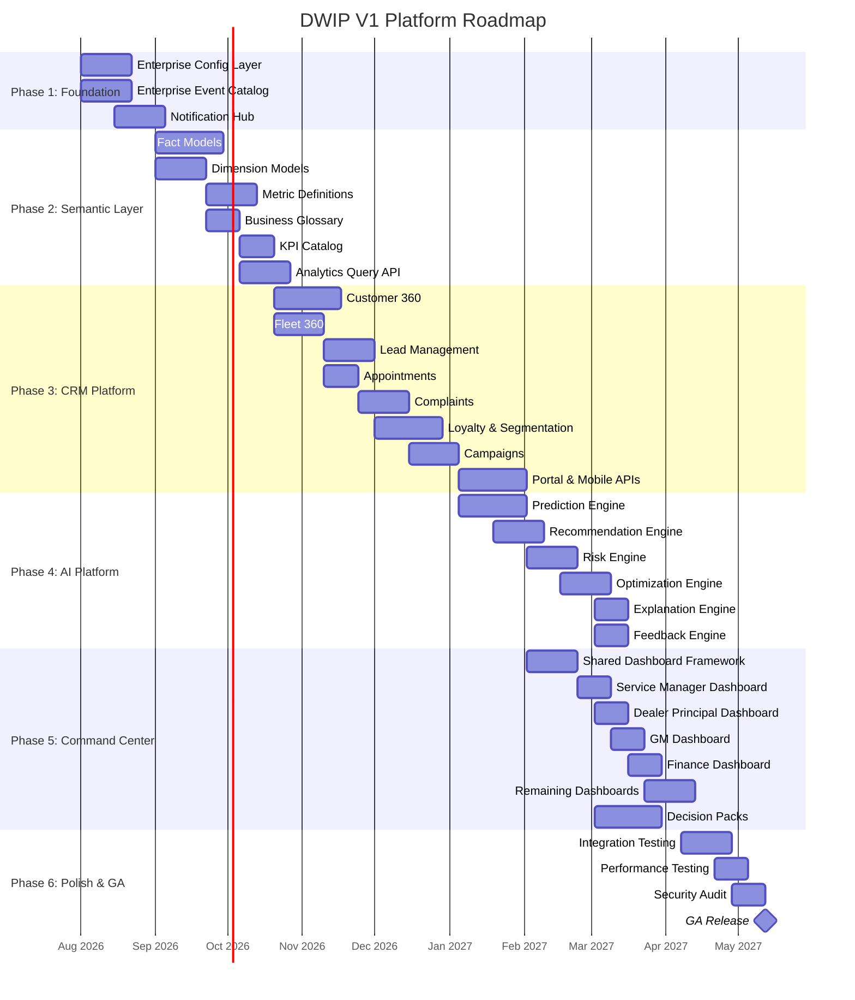

# DWIP V1 — Enterprise Architecture Master Document

**DWIP-V1-ARCH-011 · Final Architecture Review**
**Classification:** Enterprise Confidential · Architecture Only
**Date:** 2026-07-18
**Author:** Enterprise Chief Software Architect
**Status:** FINAL REVIEW

---

> [!IMPORTANT]
> This document is **architecture only**. No implementation. No TypeScript. No code.
> All frozen layers (Kernel, Workflow Framework, Business Program Framework, Workshop Core, Resource Planning, Business Programs) are preserved exactly as implemented.

---

## Table of Contents

1. [Enterprise Architecture Summary](#1-enterprise-architecture-summary)
2. [Layer Diagram](#2-layer-diagram)
3. [Dependency Diagram](#3-dependency-diagram)
4. [Module Structure](#4-module-structure)
5. [Folder Structure](#5-folder-structure)
6. [Event Catalog Design](#6-event-catalog-design)
7. [Notification Hub Design](#7-notification-hub-design)
8. [Configuration Layer](#8-configuration-layer)
9. [Decision Pack Design](#9-decision-pack-design)
10. [API Boundaries](#10-api-boundaries)
11. [Future Microservice Boundaries](#11-future-microservice-boundaries)
12. [Implementation Roadmap](#12-implementation-roadmap)
13. [Risk Assessment](#13-risk-assessment)
14. [Testing Strategy](#14-testing-strategy)
15. [Architecture Freeze Recommendation](#15-architecture-freeze-recommendation)

---

## 1. Enterprise Architecture Summary

### 1.1 Platform Identity

DWIP (Dealer Workshop Integrated Platform) is a vertically integrated enterprise system for automotive workshop operations. It spans vehicle intake through delivery, covering seven distinct business programs (Warranty, AMC, Goodwill, FSB, Insurance, Fleet Contract, Breakdown), full workshop operations, resource planning, customer experience management, enterprise analytics, AI-driven intelligence, and executive command-and-control.

### 1.2 Frozen Foundations (No Modifications Permitted)

| Layer | Status | Components |
|:------|:-------|:-----------|
| **Kernel** | 🔒 FROZEN | EventBus, EventEngine, PolicyEngine, ApprovalEngine, AuditEngine, EvidenceEngine, NotificationEngine, CircuitBreaker, TransactionManager, WorkflowRegistry, WorkflowStateMachine, DeadLetterQueue, OutboxService, TimerEngine, TimelineEngine, SchedulerEngine, QueueProcessor, IdentityContext, BusinessContext, KernelContracts |
| **Workflow Framework** | 🔒 FROZEN | BaseWorkflowStrategy, WorkflowStrategyRegistry, WorkflowDefinition profiles |
| **Business Program Framework** | 🔒 FROZEN | Program Registry, Strategy Pattern dispatch |
| **Business Programs** | 🔒 FROZEN | Warranty, AMC, Goodwill, FSB, Insurance, Fleet Contract, Breakdown — each with dedicated strategy, policy profile, evidence profile, approval profile |
| **Workshop Operations Core** | 🔒 FROZEN | GateEntry, Inspection, Estimate, Repair, QualityCheck, Roadtest, BayAllocation, TechnicianAssignment, PartsAllocation, Delivery, Wash, Feedback, Dashboard, Financial models |
| **Workshop Resource Planning** | 🔒 FROZEN | CapacityEngine, ForecastEngine, SchedulerEngine, OptimizationEngine, ShiftPlanningEngine, BayCapacityEngine, TechnicianCapacityEngine, BranchCapacityEngine, AdvisorWorkloadEngine, EquipmentUtilizationEngine, BottleneckEngine, LeaveBalancingEngine |

### 1.3 Architecture Principles

| # | Principle | Enforcement |
|:--|:----------|:------------|
| P-1 | **Single Semantic Layer** | All business metrics are defined once in Enterprise Analytics. No KPI duplication. |
| P-2 | **AI Reads Analytics** | Enterprise AI never computes raw KPIs. It consumes pre-computed metrics from the Analytics semantic layer. |
| P-3 | **Executive Isolation** | Executive Command Center never touches transactional databases. It consumes Analytics, AI, and CX exclusively. |
| P-4 | **Event-Driven Integration** | All cross-boundary communication flows through the Enterprise Event Catalog via the frozen EventBus. |
| P-5 | **Configuration Over Code** | Runtime behavior changes through the Configuration Layer, not deployments. |
| P-6 | **Decision Pack Composability** | Business decisions are packaged as versioned, auditable Decision Packs that combine Policy + AI + Analytics. |
| P-7 | **CRM Completeness** | Customer Experience Platform is the single source of truth for all customer/fleet/vehicle relationship data. |

### 1.4 Platform Census

| Metric | Count |
|:-------|:------|
| Frozen Kernel Engines | 20 |
| Business Programs | 7 |
| Workshop Core Engines | 12 |
| Resource Planning Engines | 12 |
| New Platform Modules (this review) | 4 |
| Enterprise Events (Catalog) | 48+ |
| API Boundary Groups | 14 |
| Future Microservice Domains | 9 |
| Regression Tests | 65/65 Passing |

---

## 2. Layer Diagram



### Layer Descriptions

| Layer | Name | Mutability | Description |
|:------|:-----|:-----------|:------------|
| L0 | Data | Frozen Schema | MySQL transactional store, EKG graph store, Firestore for real-time sync |
| L1 | Kernel | 🔒 Frozen | Core engines: events, policies, approvals, audits, evidence, notifications, workflows, transactions |
| L2 | Business Programs | 🔒 Frozen | Seven business program strategies implementing the Business Program Framework |
| L3 | Workshop Operations | 🔒 Frozen | Core workshop floor engines: gate entry through delivery |
| L4 | Resource Planning | 🔒 Frozen | Capacity, scheduling, forecasting, optimization, bottleneck detection |
| L5 | Enterprise Services | **Open** | Event Catalog, Notification Hub, Configuration Layer, Decision Packs |
| L6 | Intelligence Platforms | **Open** | CX/CRM, Analytics Semantic Layer, AI Engine Fleet |
| L7 | Executive Command | **Open** | Role-specific dashboards consuming L6 exclusively |

---

## 3. Dependency Diagram



### Dependency Rules (Strictly Enforced)

| Rule | From | To | Allowed |
|:-----|:-----|:---|:--------|
| DR-1 | Executive Command Center | Transactional DB | ❌ NEVER |
| DR-2 | Executive Command Center | Analytics / AI / CX | ✅ READ-ONLY |
| DR-3 | Enterprise AI | Transactional DB for KPI computation | ❌ NEVER |
| DR-4 | Enterprise AI | Analytics Semantic Layer | ✅ READ-ONLY |
| DR-5 | Enterprise AI | CX Platform (signals) | ✅ READ-ONLY |
| DR-6 | Analytics | Transactional DB | ✅ READ-ONLY (materialization) |
| DR-7 | Any Layer | Frozen Layers | ❌ No modification |
| DR-8 | Decision Packs | Kernel PolicyEngine | ✅ EVALUATE |
| DR-9 | Notification Hub | Kernel NotificationEngine | ✅ DELEGATE |

---

## 4. Module Structure

### 4.1 Customer Experience Platform (Complete CRM)

```
customer-experience-platform/
├── customer-360/                    # Unified customer profile
│   ├── CustomerProfileAggregator    # Merges data from all touchpoints
│   ├── CustomerScorecard            # CLV, satisfaction, loyalty metrics
│   ├── InteractionHistory           # Every touchpoint timestamped
│   └── PreferenceManager            # Communication/service preferences
│
├── fleet-360/                       # Fleet owner intelligence
│   ├── FleetProfileAggregator       # Fleet-wide health, cost, uptime
│   ├── FleetVehicleRegistry         # All vehicles under fleet
│   ├── FleetContractTracker         # AMC, FSB, Insurance coverage
│   └── FleetDowntimeAnalyzer        # Cost-of-downtime calculations
│
├── lead-management/                 # Sales pipeline for service
│   ├── LeadCaptureEngine            # Web, walk-in, phone, referral
│   ├── LeadScoringModel             # Propensity-to-convert scoring
│   ├── LeadAssignment               # Auto-assign to advisors
│   └── LeadConversionTracker        # Funnel analytics
│
├── fleet-owner-relationship/        # B2B relationship management
│   ├── FleetOwnerPortal             # Self-service fleet dashboard
│   ├── ContractNegotiation          # Rate cards, SLAs, terms
│   ├── EscalationManager            # Fleet-specific escalation chains
│   └── FleetOwnerCommunication      # Dedicated relationship manager
│
├── segmentation/                    # Customer segmentation engine
│   ├── SegmentationEngine           # RFM, behavioral, value-based
│   ├── SegmentDefinitions           # Configurable segment rules
│   ├── SegmentMembership            # Customer-to-segment mapping
│   └── SegmentAnalytics             # Segment performance tracking
│
├── loyalty/                         # Loyalty & retention
│   ├── LoyaltyProgramEngine         # Points, tiers, rewards
│   ├── TierCalculator               # Bronze → Silver → Gold → Platinum
│   ├── RedemptionEngine             # Points redemption logic
│   └── ChurnPrediction              # At-risk customer flagging
│
├── campaigns/                       # Marketing campaigns
│   ├── CampaignEngine               # Create, schedule, execute
│   ├── AudienceBuilder              # Segment-based targeting
│   ├── CampaignTemplates            # Service reminders, offers, recalls
│   ├── CampaignAnalytics            # Open/click/conversion rates
│   └── ABTestingEngine              # Variant testing
│
├── communication/                   # Omnichannel communication
│   ├── CommunicationOrchestrator    # Channel selection & dispatch
│   ├── TemplateEngine               # Dynamic template rendering
│   ├── ChannelAdapters              # SMS, WhatsApp, Email, Push, In-App
│   ├── DeliveryTracker              # Delivery receipts & failures
│   └── PreferenceEnforcer           # Respect opt-out/DND settings
│
├── timeline/                        # Customer journey timeline
│   ├── TimelineAggregator           # Merge events from all systems
│   ├── TimelineRenderer             # Chronological activity feed
│   ├── MilestoneTracker             # Key moments (1st visit, 10th service, etc.)
│   └── TimelineSearch               # Full-text search across events
│
├── appointments/                    # Appointment scheduling
│   ├── AppointmentEngine            # Create, modify, cancel
│   ├── SlotCalculator               # Available slots from Resource Planning
│   ├── AppointmentReminder          # Automated reminders
│   └── NoShowTracker                # No-show rate tracking
│
├── complaints/                      # Complaint management
│   ├── ComplaintCaptureEngine        # Multi-channel intake
│   ├── ComplaintClassifier           # Auto-categorization
│   ├── ComplaintEscalation          # SLA-driven escalation chains
│   ├── ResolutionTracker            # Track through to closure
│   └── CsatFollowup                # Post-resolution satisfaction survey
│
├── portal/                          # Customer self-service portal
│   ├── PortalAuthentication          # OTP/password login
│   ├── ServiceHistory               # Past job cards & invoices
│   ├── EstimateApproval             # Digital approval workflow
│   ├── LiveTracking                 # Real-time vehicle status
│   ├── DocumentDownload             # Invoices, warranty cards
│   └── FeedbackSubmission           # Post-service rating
│
└── mobile-apis/                     # Mobile-first API layer
    ├── MobileCustomerAPI             # Customer app endpoints
    ├── MobileFleetAPI                # Fleet owner app endpoints
    ├── MobileNotificationAPI         # Push notification management
    └── MobileOfflineSync             # Offline-first data sync
```

### 4.2 Enterprise Analytics Platform (Single Semantic Layer)

```
enterprise-analytics-platform/
├── semantic-layer/                  # THE single source of truth for metrics
│   ├── SemanticLayerRegistry        # Central registry of all metric definitions
│   ├── MetricResolver               # Resolves metric ID → calculation + source
│   ├── DimensionResolver            # Resolves dimension hierarchies
│   └── AccessControl                # Role-based metric visibility
│
├── fact-models/                     # Immutable fact tables
│   ├── FactJobCard                  # Job card lifecycle events
│   ├── FactRevenue                  # Revenue transactions
│   ├── FactLabour                   # Labour time & cost
│   ├── FactParts                    # Parts consumption
│   ├── FactWarrantyClaim            # Warranty claim lifecycle
│   ├── FactCustomerInteraction      # Customer touchpoints
│   ├── FactVehicleVisit             # Vehicle visit metrics
│   ├── FactTechnicianProductivity   # Technician output
│   ├── FactBayUtilization           # Bay time slots
│   └── FactCampaignResponse        # Campaign engagement
│
├── dimension-models/                # Slowly changing dimensions
│   ├── DimCustomer                  # Customer master
│   ├── DimVehicle                   # Vehicle master
│   ├── DimEmployee                  # Employee/technician master
│   ├── DimWorkshop                  # Workshop/branch master
│   ├── DimPart                      # Parts catalog
│   ├── DimServiceType               # Service types & categories
│   ├── DimFleet                     # Fleet master
│   ├── DimTime                      # Calendar dimension
│   ├── DimShift                     # Shift definitions
│   └── DimGeography                 # Location hierarchy
│
├── metric-definitions/              # Canonical KPI definitions
│   ├── OperationalMetrics           # TAT, throughput, bay utilization, queue depth
│   ├── FinancialMetrics             # Revenue, GP%, ARPU, cost-per-job
│   ├── CustomerMetrics              # CSAT, NPS, retention, churn
│   ├── WorkforceMetrics             # Productivity, efficiency, skill utilization
│   ├── WarrantyMetrics              # Claim rate, approval %, settlement time
│   ├── FleetMetrics                 # Uptime, downtime cost, fleet health score
│   ├── QualityMetrics               # FTR%, rework rate, defect density
│   └── GrowthMetrics                # Lead conversion, new customers, revenue growth
│
├── business-glossary/               # Enterprise-wide term definitions
│   ├── GlossaryRegistry             # Term → Definition → Owner → Source
│   ├── GlossaryValidator            # Ensures no duplicate/conflicting terms
│   └── GlossaryVersioning          # Track definition changes over time
│
├── unified-kpi-catalog/             # Searchable KPI catalog
│   ├── KpiCatalogRegistry           # All KPIs with metadata
│   ├── KpiLineageTracker            # KPI → Source facts → Source tables
│   ├── KpiDependencyGraph          # Which KPIs depend on which facts
│   └── KpiChangeLog                 # Historical KPI definition changes
│
├── materialization/                 # Data pipeline for analytics
│   ├── SnapshotScheduler            # Daily/hourly snapshot jobs
│   ├── IncrementalRefresh           # CDC-based incremental updates
│   ├── MaterializedViewManager      # Create/refresh materialized views
│   └── DataQualityChecker           # Validate materialized data quality
│
└── query-engine/                    # Analytics query interface
    ├── MetricQueryAPI               # Unified API: GET /metrics/{metricId}
    ├── DimensionFilterAPI           # Filter by any dimension combination
    ├── TimeSeriesAPI                # Time-range aggregations
    ├── ComparisonAPI                # Period-over-period comparisons
    └── ExportAPI                    # CSV, Excel, PDF export
```

### 4.3 Enterprise AI Platform (Separated Engines)

```
enterprise-ai-platform/
├── prediction-engine/               # Forward-looking predictions
│   ├── DemandForecaster             # Service demand by type, day, bay
│   ├── BreakdownPredictor           # Predict breakdown probability
│   ├── PartsDemandPredictor        # Parts inventory demand forecast
│   ├── CustomerChurnPredictor       # At-risk customer identification
│   ├── RevenueForecaster            # Revenue projection models
│   ├── TATPredictor                 # Estimated completion time
│   └── ModelRegistry                # Version, deploy, rollback models
│
├── recommendation-engine/           # Contextual recommendations
│   ├── ServiceRecommender           # Additional services for vehicle
│   ├── TechnicianRecommender        # Best technician for job type
│   ├── UpsellRecommender            # Cross-sell/upsell opportunities
│   ├── ScheduleRecommender          # Optimal appointment slots
│   ├── PartSubstitution             # Alternative parts recommendations
│   └── RepairDnaRecommender         # Based on EKG repair patterns
│
├── optimization-engine/             # Constrained optimization
│   ├── BayScheduleOptimizer         # Minimize idle time across bays
│   ├── TechnicianLoadBalancer       # Even distribution of workload
│   ├── PartsInventoryOptimizer      # Min cost / max availability
│   ├── RoutingOptimizer             # Pickup/delivery route optimization
│   └── PricingOptimizer             # Dynamic pricing for fleet contracts
│
├── risk-engine/                     # Risk assessment & scoring
│   ├── WarrantyFraudDetector        # Anomalous claim patterns
│   ├── SlaBreachPredictor           # Early warning for SLA breach
│   ├── QualityRiskScorer            # Job quality risk assessment
│   ├── CustomerRiskScorer           # Payment/collection risk
│   └── OperationalRiskScorer        # Workshop capacity risk alerts
│
├── explanation-engine/              # Explainable AI
│   ├── DecisionExplainer            # Why AI recommended X
│   ├── FeatureImportance            # Top factors in a prediction
│   ├── CounterfactualGenerator      # "What if" scenario analysis
│   ├── ConfidenceCalibrator         # Confidence score normalization
│   └── AuditTrailGenerator          # AI decision audit records
│
└── feedback-engine/                 # Human-in-the-loop learning
    ├── FeedbackCollector            # Capture accept/reject/override
    ├── FeedbackAnalyzer             # Analyze feedback patterns
    ├── ModelRetrainer               # Trigger retraining from feedback
    ├── AccuracyTracker              # Track prediction accuracy over time
    └── BiasDetector                 # Monitor for demographic/operational bias
```

### 4.4 Executive Command Center (Role-Specific Dashboards)

```
executive-command-center/
├── shared/                          # Shared dashboard infrastructure
│   ├── DashboardFramework           # Widget system, layout engine
│   ├── WidgetRegistry               # Available widget catalog
│   ├── DrilldownEngine              # Click-through to detail views
│   ├── AlertFeedWidget              # Real-time alert stream
│   ├── ComparisonWidget             # Period/branch comparison
│   └── ExportEngine                 # Report generation & export
│
├── dealer-principal/                # Dealer Principal (Owner) Dashboard
│   ├── PnLOverview                  # Profit & Loss summary
│   ├── RevenueAnalysis              # Revenue by program, branch, period
│   ├── CustomerRetention            # Retention & churn metrics
│   ├── FleetPortfolio               # Fleet contract overview
│   ├── BranchComparison             # Multi-branch performance
│   ├── StrategicAlerts              # Critical business alerts
│   └── InvestmentROI                # ROI on equipment, training, programs
│
├── ceo/                             # CEO Dashboard
│   ├── BusinessHealthIndex          # Composite health score
│   ├── MarketShareTrends            # Market position tracking
│   ├── GrowthMetrics                # YoY, QoQ growth indicators
│   ├── CompetitorBenchmark          # Industry benchmark comparison
│   ├── TopRisks                     # Enterprise risk register
│   └── StrategicInitiatives         # Initiative progress tracker
│
├── gm/                              # General Manager Dashboard
│   ├── OperationalOverview          # All-workshop summary
│   ├── WorkforceEfficiency          # Staff productivity overview
│   ├── ServiceMixAnalysis           # Revenue by service type
│   ├── QualityScorecard             # FTR, rework, CSAT
│   ├── EscalationTracker            # Pending escalations
│   └── MonthlyTargets               # Target vs actual tracking
│
├── service-manager/                 # Service Manager Dashboard
│   ├── LiveFloorView                # Real-time workshop floor
│   ├── TATDashboard                 # Turnaround time monitoring
│   ├── TechnicianPerformance        # Individual tech metrics
│   ├── BayUtilization               # Bay occupancy heat map
│   ├── PendingApprovals             # Approval queue
│   ├── SlaMonitor                   # Active SLA tracking
│   └── DailyDispatch                # Today's schedule & capacity
│
├── workshop-controller/             # Workshop Controller Dashboard
│   ├── CostAnalysis                 # Job cost breakdown
│   ├── LaborRecovery                # Billed vs actual hours
│   ├── PartsCostTracking            # Parts margin analysis
│   ├── WarrantyRecovery             # Claim recovery tracking
│   ├── InventoryTurnover            # Parts inventory velocity
│   └── BillingExceptions            # Unbilled/anomalous jobs
│
├── finance/                         # Finance Dashboard
│   ├── RevenueReconciliation        # Daily/weekly revenue recon
│   ├── AccountsReceivable           # Outstanding collections
│   ├── CashFlowProjection           # Forward cash flow
│   ├── TaxCompliance                # GST/tax compliance status
│   ├── CreditNoteTracker            # Credit notes & adjustments
│   └── BudgetVariance               # Budget vs actual tracking
│
├── hr/                              # HR Dashboard
│   ├── AttendanceOverview           # Attendance & punctuality
│   ├── OvertimeAnalysis             # Overtime hours & cost
│   ├── SkillMatrix                  # Technician skill mapping
│   ├── TrainingTracker              # Certification progress
│   ├── AttritionAnalysis            # Turnover & exit reasons
│   └── PerformanceReviews           # Review cycle status
│
├── branch-manager/                  # Branch Manager Dashboard
│   ├── BranchP&L                    # Branch profit & loss
│   ├── BranchCapacity               # Capacity utilization
│   ├── BranchCustomerSat            # Branch CSAT/NPS
│   ├── BranchComplaints             # Complaint resolution status
│   ├── BranchTargets                # Monthly target tracking
│   └── BranchStaffing               # Staff allocation & leaves
│
└── operations/                      # Operations Dashboard
    ├── MultiWorkshopView            # Cross-workshop comparison
    ├── FleetOperations              # Fleet vehicle status map
    ├── SupplyChainStatus            # Parts pipeline visibility
    ├── QueueDepthMonitor            # Real-time queue depths
    ├── BottleneckAlerts             # Live bottleneck detection
    └── DispatchPlanning             # Daily operations planning
```

---

## 5. Folder Structure

```
src/
├── core/                           🔒 FROZEN — Kernel
│   ├── event-bus.ts
│   ├── event-engine.ts
│   ├── policy-engine.ts
│   ├── approval-engine.ts
│   ├── audit-engine.ts
│   ├── evidence-engine.ts
│   ├── notification-engine.ts
│   ├── notification-provider.ts
│   ├── notification-queue.ts
│   ├── notification-metadata.ts
│   ├── notification-event-listener.ts
│   ├── circuit-breaker.ts
│   ├── transaction-manager.ts
│   ├── workflow-registry.ts
│   ├── workflow-state-machine.ts
│   ├── workflow-strategies.ts
│   ├── dead-letter-queue.ts
│   ├── outbox-service.ts
│   ├── identity.ts
│   ├── kernel-contracts.ts
│   ├── business-context.ts
│   ├── repository.ts
│   ├── repositories.ts
│   ├── alert-service.ts
│   ├── application-services.ts
│   ├── business-case-engine.ts
│   ├── dashboard-snapshot-engine.ts
│   ├── ekg-event-listener.ts
│   ├── storage-provider.ts
│   ├── queue-processor.ts
│   ├── scheduler.ts
│   ├── timer-engine.ts
│   ├── timeline-engine.ts
│   ├── escalation-engine.ts
│   ├── escalation/
│   ├── queue/
│   ├── scheduler/
│   ├── timeline/
│   └── timer/
│
├── workflows/                      🔒 FROZEN — Business Programs
│   ├── base-workflow-strategy.ts
│   ├── workflow-strategy-registry.ts
│   ├── warranty/
│   ├── amc/
│   ├── goodwill/
│   ├── fsb/
│   ├── insurance/
│   ├── breakdown/
│   └── common/
│
├── workshop/                       🔒 FROZEN — Workshop Operations Core
│   ├── gate-entry-engine.ts
│   ├── inspection-engine.ts
│   ├── estimate-engine.ts
│   ├── repair-engine.ts
│   ├── quality-engine.ts
│   ├── roadtest-engine.ts
│   ├── bay-allocation-engine.ts
│   ├── technician-assignment-engine.ts
│   ├── parts-allocation-engine.ts
│   ├── delivery-engine.ts
│   ├── wash-engine.ts
│   ├── feedback-engine.ts
│   ├── approval-engine.ts
│   ├── *-models.ts
│   └── resource-planning/          🔒 FROZEN — Resource Planning
│       ├── capacity-engine.ts
│       ├── forecast-engine.ts
│       ├── scheduler-engine.ts
│       ├── optimization-engine.ts
│       ├── shift-planning-engine.ts
│       ├── bay-capacity-engine.ts
│       ├── technician-capacity-engine.ts
│       ├── branch-capacity-engine.ts
│       ├── advisor-workload-engine.ts
│       ├── equipment-utilization-engine.ts
│       ├── bottleneck-engine.ts
│       ├── leave-balancing-engine.ts
│       └── *-models.ts
│
├── engines/                        🔒 FROZEN — Existing Engines
│   ├── ekg-engine.ts
│   ├── ai-copilot-orchestrator.ts
│   ├── fleet-intelligence-engine.ts
│   ├── fleet-rules-evaluator.ts
│   ├── revenue-split-engine.ts
│   ├── technician-kpi-calculator.ts
│   ├── technician-leaderboard-service.ts
│   ├── daily-kpi-snapshot-job.ts
│   ├── productivity-alerts.ts
│   ├── rework-tracking-service.ts
│   ├── overtime-rules.ts
│   ├── ocr-processor.ts
│   ├── face-verifier.ts
│   ├── document-verification/
│   ├── vehicle-passport/
│   └── workflow/
│
├── platforms/                      ✅ NEW — Platform Modules
│   ├── customer-experience/         # CRM Platform
│   │   ├── customer-360/
│   │   ├── fleet-360/
│   │   ├── lead-management/
│   │   ├── fleet-owner-relationship/
│   │   ├── segmentation/
│   │   ├── loyalty/
│   │   ├── campaigns/
│   │   ├── communication/
│   │   ├── timeline/
│   │   ├── appointments/
│   │   ├── complaints/
│   │   ├── portal/
│   │   └── mobile-apis/
│   │
│   ├── analytics/                   # Analytics Semantic Layer
│   │   ├── semantic-layer/
│   │   ├── fact-models/
│   │   ├── dimension-models/
│   │   ├── metric-definitions/
│   │   ├── business-glossary/
│   │   ├── unified-kpi-catalog/
│   │   ├── materialization/
│   │   └── query-engine/
│   │
│   ├── ai/                          # AI Platform
│   │   ├── prediction-engine/
│   │   ├── recommendation-engine/
│   │   ├── optimization-engine/
│   │   ├── risk-engine/
│   │   ├── explanation-engine/
│   │   └── feedback-engine/
│   │
│   └── command-center/              # Executive Command Center
│       ├── shared/
│       ├── dealer-principal/
│       ├── ceo/
│       ├── gm/
│       ├── service-manager/
│       ├── workshop-controller/
│       ├── finance/
│       ├── hr/
│       ├── branch-manager/
│       └── operations/
│
├── enterprise/                     ✅ NEW — Enterprise Services
│   ├── event-catalog/
│   │   ├── catalog-registry.ts
│   │   ├── event-schemas/
│   │   └── event-versioning.ts
│   │
│   ├── notification-hub/
│   │   ├── hub-router.ts
│   │   ├── channel-registry.ts
│   │   ├── preference-engine.ts
│   │   ├── template-store.ts
│   │   └── delivery-tracker.ts
│   │
│   ├── configuration/
│   │   ├── config-registry.ts
│   │   ├── config-scopes.ts
│   │   ├── config-versioning.ts
│   │   ├── feature-flags.ts
│   │   └── runtime-overrides.ts
│   │
│   └── decision-packs/
│       ├── decision-pack-registry.ts
│       ├── decision-evaluator.ts
│       ├── decision-composer.ts
│       └── decision-audit-trail.ts
│
├── tests/                          🔒 FROZEN — 65/65 Passing
│   └── *.spec.ts / *.test.ts
│
├── db/                             🔒 FROZEN — Database Layer
├── components/                     🔒 FROZEN — UI Components
├── hooks/                          🔒 FROZEN — React Hooks
├── lib/                            🔒 FROZEN — Shared Libraries
├── config/                         🔒 FROZEN — App Config
├── reporting/                      🔒 FROZEN — Reporting
└── types.ts                        🔒 FROZEN — Type Definitions
```

---

## 6. Event Catalog Design

### 6.1 Architecture

The Enterprise Event Catalog is a **registry** that sits above the frozen EventBus. It does not replace the EventBus — it catalogs, versions, validates, and documents every event type flowing through the system.



### 6.2 Event Catalog Registry

| Domain | Event Type | Category | Version | Schema ID |
|:-------|:-----------|:---------|:--------|:----------|
| **Workshop Core** | `VEHICLE_GATE_IN` | Operational | 1.0 | `EVT-WOC-001` |
| Workshop Core | `INTAKE_INITIALIZED` | Operational | 1.0 | `EVT-WOC-002` |
| Workshop Core | `DIAGNOSTIC_STARTED` | Operational | 1.0 | `EVT-WOC-003` |
| Workshop Core | `ESTIMATE_PREPARED` | Operational | 1.0 | `EVT-WOC-004` |
| Workshop Core | `ESTIMATE_APPROVED` | Operational | 1.0 | `EVT-WOC-005` |
| Workshop Core | `PARTS_REQUESTED` | Integration | 1.0 | `EVT-WOC-006` |
| Workshop Core | `WIP_STARTED` | Operational | 1.0 | `EVT-WOC-007` |
| Workshop Core | `QC_SUBMITTED` | Operational | 1.0 | `EVT-WOC-008` |
| Workshop Core | `QC_FAILED` | Operational | 1.0 | `EVT-WOC-009` |
| Workshop Core | `FINAL_REVIEW_STARTED` | Operational | 1.0 | `EVT-WOC-010` |
| Workshop Core | `INVOICE_GENERATED` | Integration | 1.0 | `EVT-WOC-011` |
| Workshop Core | `VEHICLE_RELEASED` | Operational | 1.0 | `EVT-WOC-012` |
| Workshop Core | `BAY_ALLOCATED` | Operational | 1.0 | `EVT-WOC-013` |
| Workshop Core | `TECHNICIAN_ASSIGNED` | Operational | 1.0 | `EVT-WOC-014` |
| **Business Programs** | `WARRANTY_CLAIM_SUBMITTED` | Business | 1.0 | `EVT-BIZ-001` |
| Business Programs | `WARRANTY_CLAIM_APPROVED` | Business | 1.0 | `EVT-BIZ-002` |
| Business Programs | `WARRANTY_CLAIM_REJECTED` | Business | 1.0 | `EVT-BIZ-003` |
| Business Programs | `AMC_ACTIVATED` | Business | 1.0 | `EVT-BIZ-004` |
| Business Programs | `AMC_RENEWED` | Business | 1.0 | `EVT-BIZ-005` |
| Business Programs | `GOODWILL_REQUESTED` | Business | 1.0 | `EVT-BIZ-006` |
| Business Programs | `GOODWILL_APPROVED` | Business | 1.0 | `EVT-BIZ-007` |
| Business Programs | `FSB_INITIATED` | Business | 1.0 | `EVT-BIZ-008` |
| Business Programs | `FSB_COMPLETED` | Business | 1.0 | `EVT-BIZ-009` |
| Business Programs | `INSURANCE_CLAIM_FILED` | Business | 1.0 | `EVT-BIZ-010` |
| Business Programs | `FLEET_CONTRACT_ACTIVATED` | Business | 1.0 | `EVT-BIZ-011` |
| Business Programs | `BREAKDOWN_REPORTED` | Business | 1.0 | `EVT-BIZ-012` |
| Business Programs | `BREAKDOWN_RESOLVED` | Business | 1.0 | `EVT-BIZ-013` |
| **System** | `SLA_BREACHED` | System | 1.0 | `EVT-SYS-001` |
| System | `DECISION_OVERRIDDEN` | AI | 1.0 | `EVT-SYS-002` |
| System | `APPROVAL_ESCALATED` | System | 1.0 | `EVT-SYS-003` |
| System | `CIRCUIT_BREAKER_OPENED` | System | 1.0 | `EVT-SYS-004` |
| System | `DLQ_MESSAGE_ADDED` | System | 1.0 | `EVT-SYS-005` |
| **CX Platform** | `CUSTOMER_CREATED` | CRM | 1.0 | `EVT-CX-001` |
| CX Platform | `COMPLAINT_FILED` | CRM | 1.0 | `EVT-CX-002` |
| CX Platform | `COMPLAINT_RESOLVED` | CRM | 1.0 | `EVT-CX-003` |
| CX Platform | `APPOINTMENT_BOOKED` | CRM | 1.0 | `EVT-CX-004` |
| CX Platform | `LOYALTY_TIER_CHANGED` | CRM | 1.0 | `EVT-CX-005` |
| CX Platform | `CAMPAIGN_SENT` | CRM | 1.0 | `EVT-CX-006` |
| CX Platform | `LEAD_CREATED` | CRM | 1.0 | `EVT-CX-007` |
| CX Platform | `LEAD_CONVERTED` | CRM | 1.0 | `EVT-CX-008` |
| **Analytics** | `KPI_SNAPSHOT_GENERATED` | Analytics | 1.0 | `EVT-AN-001` |
| Analytics | `METRIC_THRESHOLD_BREACHED` | Analytics | 1.0 | `EVT-AN-002` |
| Analytics | `DATA_QUALITY_ALERT` | Analytics | 1.0 | `EVT-AN-003` |
| **AI Platform** | `AI_PREDICTION_GENERATED` | AI | 1.0 | `EVT-AI-001` |
| AI Platform | `AI_RECOMMENDATION_CREATED` | AI | 1.0 | `EVT-AI-002` |
| AI Platform | `AI_FEEDBACK_RECEIVED` | AI | 1.0 | `EVT-AI-003` |
| AI Platform | `AI_MODEL_RETRAINED` | AI | 1.0 | `EVT-AI-004` |
| **Notification** | `NOTIFICATION_SENT` | System | 1.0 | `EVT-NF-001` |
| Notification | `NOTIFICATION_ESCALATED` | System | 1.0 | `EVT-NF-002` |
| Notification | `NOTIFICATION_FAILED` | System | 1.0 | `EVT-NF-003` |

### 6.3 Event Versioning Strategy

| Rule | Description |
|:-----|:------------|
| Backward Compatible | New optional fields can be added to existing schema version |
| Breaking Change | Schema ID increments (e.g., `EVT-WOC-001` v1.0 → v2.0) |
| Deprecation Window | Old version supported for 90 days after new version release |
| Consumer Registry | Each event tracks which consumers subscribe to it |
| Schema Validation | Events validated against registered schema before publish |

---

## 7. Notification Hub Design

### 7.1 Architecture

The Notification Hub is a **routing and orchestration layer** that sits between the Enterprise Event Catalog and the frozen Kernel NotificationEngine. It adds preference management, template resolution, channel intelligence, and delivery tracking.



### 7.2 Notification Hub Components

| Component | Responsibility |
|:----------|:---------------|
| **Hub Router** | Receives events from catalog, determines notification rules, routes to appropriate processing path |
| **Preference Engine** | Resolves user/role notification preferences (channel, frequency, DND hours, language) |
| **Template Store** | Manages versioned notification templates by event type and locale |
| **Channel Selector** | Selects optimal channel based on preference + urgency + availability |
| **Batch Processor** | Aggregates low-priority notifications for batch delivery |
| **Digest Builder** | Creates daily/weekly digest summaries for managers |
| **Delivery Tracker** | Tracks delivery status, receipts, failures, retries |

### 7.3 Notification Routing Matrix

| Event Category | Priority | Channel Strategy | Digest Eligible |
|:---------------|:---------|:-----------------|:----------------|
| SLA_BREACHED | CRITICAL | SMS + WhatsApp + Push (immediate) | No |
| QC_FAILED | HIGH | In-App + Push | No |
| APPROVAL_ESCALATED | HIGH | SMS + In-App | No |
| VEHICLE_RELEASED | MEDIUM | SMS to customer + In-App | No |
| ESTIMATE_PREPARED | MEDIUM | WhatsApp to customer | No |
| KPI_SNAPSHOT_GENERATED | LOW | Email digest | Yes |
| AI_RECOMMENDATION_CREATED | MEDIUM | In-App | Yes |
| CAMPAIGN_SENT | LOW | Batch email | Yes |
| LOYALTY_TIER_CHANGED | LOW | Push + Email | Yes |

---

## 8. Configuration Layer

### 8.1 Architecture

The Enterprise Configuration Layer provides a centralized, hierarchical, versioned configuration store that all platform modules read from at runtime.



### 8.2 Configuration Scopes (Hierarchical)

| Scope Level | Identifier | Example | Override Precedence |
|:------------|:-----------|:--------|:--------------------|
| **Global** | `GLOBAL` | System-wide defaults | Lowest (1) |
| **Dealer Group** | `DG:{dealerGroupId}` | Multi-dealer chain settings | 2 |
| **Dealer** | `DEALER:{dealerId}` | Single dealer settings | 3 |
| **Branch** | `BRANCH:{branchId}` | Branch-specific settings | 4 |
| **Workshop** | `WORKSHOP:{workshopId}` | Workshop-specific settings | 5 |
| **Role** | `ROLE:{roleId}` | Role-specific settings | 6 |
| **User** | `USER:{userId}` | Individual user settings | Highest (7) |

### 8.3 Configuration Domains

| Domain | Config Keys (Examples) | Type |
|:-------|:-----------------------|:-----|
| **SLA** | `sla.diagnostic.warning_minutes`, `sla.total_tat.breach_hours` | Integer |
| **Notifications** | `notification.sla_breach.channels`, `notification.digest.frequency` | String[] |
| **Approval** | `approval.goodwill.threshold_amount`, `approval.warranty.auto_approve_below` | Decimal |
| **Business Rules** | `rule.warranty.max_vehicle_age_months`, `rule.amc.grace_period_days` | Integer |
| **AI** | `ai.prediction.confidence_threshold`, `ai.recommendation.auto_execute` | Float/Boolean |
| **Feature Flags** | `feature.customer_portal.enabled`, `feature.ai_copilot.enabled` | Boolean |
| **UI** | `ui.dashboard.refresh_interval_sec`, `ui.theme` | Integer/String |
| **Integration** | `integration.oracle.sync_interval_min`, `integration.dms.enabled` | Integer/Boolean |

### 8.4 Feature Flag Categories

| Category | Purpose | Examples |
|:---------|:--------|:--------|
| **Release Flags** | Gradual feature rollout | `ff.customer_portal`, `ff.mobile_app` |
| **Experiment Flags** | A/B testing | `ff.new_estimate_flow`, `ff.ai_upsell` |
| **Ops Flags** | Operational toggles | `ff.dms_import`, `ff.oracle_sync` |
| **Permission Flags** | Access control supplements | `ff.fleet_360_access`, `ff.dp_dashboard` |

---

## 9. Decision Pack Design

### 9.1 Concept

A **Decision Pack** is a composable, versioned, auditable unit that bundles together a business decision. It combines Policy evaluation, Analytics metrics, and AI recommendations into a single atomic decision envelope.



### 9.2 Decision Pack Catalog

| Pack ID | Name | Inputs | Output | Used By |
|:--------|:-----|:-------|:-------|:--------|
| `DP-WAR-001` | Warranty Eligibility Decision | Policy verdict, vehicle age, mileage, claim history | Approve / Reject / Escalate | Warranty workflow |
| `DP-GDW-001` | Goodwill Authorization Decision | Customer lifetime value, visit frequency, claim amount, policy | Approve with %, Reject | Goodwill workflow |
| `DP-SLA-001` | SLA Breach Response Decision | Current TAT, breach severity, customer tier, technician load | Escalate / Reassign / Extend | SLA monitoring |
| `DP-SCH-001` | Appointment Slot Decision | Bay capacity, technician availability, forecast demand, priority | Recommend slot / Waitlist | Appointment engine |
| `DP-UPS-001` | Upsell Recommendation Decision | Vehicle age, service history, customer segment, AI prediction | Recommend services / Skip | Service advisor |
| `DP-ASN-001` | Technician Assignment Decision | Skill match, current load, historical FTR%, AI recommendation | Assign technician | Floor supervisor |
| `DP-INV-001` | Parts Reorder Decision | Current stock, demand forecast, lead time, budget | Reorder quantity / Skip | Parts manager |
| `DP-CHN-001` | Customer Churn Intervention | Churn prediction score, CLV, last visit date, segment | Retain offer / Standard | Campaign engine |
| `DP-PRC-001` | Fleet Contract Pricing Decision | Fleet size, service mix, historical cost, competitor rates | Suggested pricing | Fleet contracts |

### 9.3 Decision Pack Lifecycle

```
  ┌──────────┐    ┌──────────────┐    ┌────────────┐    ┌──────────────┐    ┌────────────┐
  │ ASSEMBLE │───▶│   EVALUATE   │───▶│   DECIDE   │───▶│    AUDIT     │───▶│   ARCHIVE  │
  │          │    │              │    │            │    │              │    │            │
  │ Gather   │    │ Run policy,  │    │ Apply      │    │ Log decision │    │ Immutable  │
  │ inputs   │    │ fetch metrics│    │ decision   │    │ + all inputs │    │ storage    │
  │ from all │    │ get AI preds │    │ rules      │    │ + outcome    │    │ for        │
  │ sources  │    │              │    │            │    │              │    │ compliance │
  └──────────┘    └──────────────┘    └────────────┘    └──────────────┘    └────────────┘
```

### 9.4 Decision Pack Audit Record

| Field | Description |
|:------|:------------|
| `decision_pack_id` | Unique ID (e.g., `DP-WAR-001-20260718-A3F8`) |
| `pack_type` | Reference to pack catalog entry |
| `pack_version` | Version of the decision pack template |
| `input_snapshot` | JSON of all inputs at decision time |
| `policy_verdict` | PolicyEngine result |
| `metric_values` | Analytics metric values used |
| `ai_prediction` | AI prediction/recommendation used |
| `config_values` | Configuration values active at decision time |
| `decision_output` | Final decision + rationale |
| `decided_by` | System or human actor |
| `human_override` | Was there a human override? |
| `override_reason` | If overridden, why? |
| `timestamp` | ISO-8601 UTC |
| `correlation_id` | Links to job card / entity |

---

## 10. API Boundaries

### 10.1 API Domain Map

| # | API Domain | Base Path | Auth | Rate Limit |
|:--|:-----------|:----------|:-----|:-----------|
| 1 | **Workshop Operations** | `/api/v1/workshop/*` | JWT (Role) | 100 req/s |
| 2 | **Business Programs** | `/api/v1/programs/*` | JWT (Role) | 50 req/s |
| 3 | **Customer Experience** | `/api/v1/cx/*` | JWT (Role) | 100 req/s |
| 4 | **Customer Portal** | `/api/v1/portal/*` | OTP/JWT (Customer) | 30 req/s |
| 5 | **Fleet Portal** | `/api/v1/fleet-portal/*` | JWT (Fleet Owner) | 30 req/s |
| 6 | **Analytics** | `/api/v1/analytics/*` | JWT (Role) | 200 req/s |
| 7 | **AI Platform** | `/api/v1/ai/*` | JWT (Role) | 50 req/s |
| 8 | **Command Center** | `/api/v1/executive/*` | JWT (Executive) | 100 req/s |
| 9 | **Notifications** | `/api/v1/notifications/*` | JWT (System) | 200 req/s |
| 10 | **Configuration** | `/api/v1/config/*` | JWT (Admin) | 20 req/s |
| 11 | **Events** | `/api/v1/events/*` | JWT (System) | 500 req/s |
| 12 | **Decision Packs** | `/api/v1/decisions/*` | JWT (Role) | 50 req/s |
| 13 | **Mobile** | `/api/v1/mobile/*` | JWT (User) | 100 req/s |
| 14 | **Integration** | `/api/v1/integration/*` | API Key | 50 req/s |

### 10.2 Key API Contracts

#### Analytics Metric API

```
GET /api/v1/analytics/metrics/{metricId}
  ?dimensions=workshop,period
  &filters=workshop_id:W001,period:2026-Q3
  &granularity=daily

Response:
{
  "metric_id": "TAT_AVG",
  "metric_name": "Average Turnaround Time",
  "unit": "hours",
  "values": [ { "date": "2026-07-17", "value": 18.4, "dimensions": { "workshop": "W001" } } ],
  "lineage": { "fact_table": "FactJobCard", "calculation": "AVG(gate_out - gate_in)" }
}
```

#### Decision Pack Evaluation API

```
POST /api/v1/decisions/evaluate
{
  "pack_type": "DP-WAR-001",
  "entity_type": "JobCard",
  "entity_id": "JC-12345",
  "context": {
    "vehicle_age_months": 24,
    "vehicle_mileage_km": 45000,
    "claim_value": 15000,
    "vin": "MAT123456789"
  }
}

Response:
{
  "decision_pack_id": "DP-WAR-001-20260718-A3F8",
  "decision": "APPROVED",
  "rationale": "All policy criteria met. Vehicle within age/mileage limits.",
  "policy_verdict": { "decision": "Approved", "policy_id": "POL-WAR-2026-Q3" },
  "ai_confidence": 0.95,
  "requires_human_approval": false,
  "audit_id": "AUD-20260718-X4K2"
}
```

---

## 11. Future Microservice Boundaries

### 11.1 Microservice Domain Map

The monolith is designed with clear bounded contexts that can be extracted into independent microservices when scale demands it.



### 11.2 Microservice Extraction Order

| Phase | Service | Current Location | Database | Extraction Trigger |
|:------|:--------|:-----------------|:---------|:-------------------|
| Phase 1 | `config-service` | `src/enterprise/configuration/` | Dedicated Config DB | First extraction — lowest risk, all modules consume via API |
| Phase 1 | `notification-service` | `src/enterprise/notification-hub/` + `src/core/notification-*` | Shared + Queue | High fan-out, benefits from independent scaling |
| Phase 2 | `event-service` | `src/core/event-*` + `src/enterprise/event-catalog/` | Event Store | Replace in-memory EventBus with message broker |
| Phase 2 | `identity-service` | `src/core/identity.ts` + `src/lib/auth.ts` | Auth DB | Centralized auth, OAuth2/OIDC support |
| Phase 3 | `analytics-service` | `src/platforms/analytics/` | Analytics Data Warehouse | Heavy read workloads, separate scaling profile |
| Phase 3 | `customer-service` | `src/platforms/customer-experience/` | Customer DB | CRM data isolation, portal scaling |
| Phase 4 | `ai-service` | `src/platforms/ai/` | Model Store + Feature Store | GPU/compute scaling, model versioning |
| Phase 4 | `workshop-service` | `src/workshop/` + `src/core/` | Workshop DB | Core transactional isolation |
| Phase 5 | `program-service` | `src/workflows/` | Program DB | Per-program scaling if needed |

### 11.3 Inter-Service Communication Patterns

| Pattern | Use Case | Protocol |
|:--------|:---------|:---------|
| **Sync Request/Response** | API calls, real-time queries | REST / gRPC |
| **Async Events** | State changes, notifications | Message Broker (Kafka/RabbitMQ) |
| **Event Sourcing** | Event replay, audit trail | Event Store |
| **Saga Pattern** | Cross-service transactions (e.g., warranty claim + payment) | Choreography-based saga |
| **CQRS** | Analytics reads vs operational writes | Separate read/write models |

### 11.4 Data Ownership Rules

| Service | Owns | Reads From |
|:--------|:-----|:-----------|
| `workshop-service` | Job cards, bays, technician assignments | Config, Identity |
| `program-service` | Business program policies, claims | Workshop (job cards), Config |
| `customer-service` | Customer profiles, fleet passports, complaints, loyalty | Workshop (visit history), Config |
| `analytics-service` | Fact tables, dimensions, metrics | All services (via events) |
| `ai-service` | Models, predictions, feedback | Analytics (metrics), Customer (CX signals) |
| `notification-service` | Templates, delivery records, preferences | Config, Identity |
| `config-service` | All configuration, feature flags | None (source of truth) |
| `event-service` | Event catalog, event store | None (receives from all) |
| `identity-service` | Users, roles, sessions, permissions | Config |

---

## 12. Implementation Roadmap

### 12.1 Phase Overview



### 12.2 Phase Details

| Phase | Duration | Deliverables | Prerequisites |
|:------|:---------|:-------------|:--------------|
| **Phase 1: Foundation** | 5 weeks | Config Layer, Event Catalog, Notification Hub | Frozen core (done) |
| **Phase 2: Semantic Layer** | 7 weeks | Fact/Dimension models, Metric defs, Glossary, KPI Catalog, Query API | Phase 1 |
| **Phase 3: CRM Platform** | 12 weeks | Complete CRM with 13 modules | Phase 1, Phase 2 (partial) |
| **Phase 4: AI Platform** | 9 weeks | 6 AI engines with feedback loop | Phase 2 (semantic layer) |
| **Phase 5: Command Center** | 8 weeks | 9 role dashboards, Decision Packs | Phase 2, Phase 4 |
| **Phase 6: GA** | 5 weeks | Integration/perf/security testing, GA release | All phases |

---

## 13. Risk Assessment

### 13.1 Risk Register

| ID | Risk | Probability | Impact | Severity | Mitigation |
|:---|:-----|:------------|:-------|:---------|:-----------|
| R-01 | **Semantic Layer becomes bottleneck** — All reads funneling through Analytics creates a single point of failure | Medium | Critical | 🔴 High | Implement read replicas, materialized view caching, circuit breaker on Analytics API |
| R-02 | **AI Platform cold-start** — No historical training data for prediction models at launch | High | Medium | 🟠 Medium | Bootstrap with rule-based models, transition to ML as data accumulates over 6 months |
| R-03 | **Frozen layer impedance mismatch** — New platforms may need kernel capabilities not present in frozen API surface | Medium | High | 🔴 High | Design new platforms to compose around frozen APIs, not require changes. Add adapter layers if needed |
| R-04 | **CRM data migration** — Migrating existing scattered customer data into unified Customer 360 | Medium | Medium | 🟠 Medium | Build ETL pipeline with validation, run parallel-read period before cutover |
| R-05 | **Event schema evolution** — As systems grow, event schemas need changes that could break consumers | Medium | High | 🔴 High | Strict versioning, deprecation windows, consumer registry, backward-compatible additions only |
| R-06 | **Decision Pack complexity** — Over-engineering simple decisions with the pack framework | Low | Medium | 🟡 Low | Reserve Decision Packs for cross-system decisions only. Simple decisions stay in PolicyEngine |
| R-07 | **Dashboard data staleness** — Executives expect real-time but Analytics materializes periodically | Medium | Medium | 🟠 Medium | Hybrid approach: critical metrics stream real-time, non-critical refresh on schedule |
| R-08 | **Notification fatigue** — Too many notifications degrade user experience | High | Medium | 🟠 Medium | Implement digest mode, DND windows, frequency caps, user preference controls |
| R-09 | **Configuration drift** — Different branches accumulating incompatible configurations | Medium | Medium | 🟠 Medium | Config validation rules, drift detection alerts, regular config audits |
| R-10 | **Microservice premature extraction** — Extracting services before understanding traffic patterns | Low | High | 🟡 Low | Strict extraction triggers (load thresholds), monolith-first approach, extract only when data supports it |

### 13.2 Risk Heat Map

```
         │ Low Impact    │ Medium Impact │ High Impact  │ Critical     │
─────────┼───────────────┼───────────────┼──────────────┼──────────────┤
High     │               │ R-02, R-08    │              │              │
Prob.    │               │               │              │              │
─────────┼───────────────┼───────────────┼──────────────┼──────────────┤
Medium   │               │ R-04, R-07,   │ R-03, R-05   │ R-01         │
Prob.    │               │ R-09          │              │              │
─────────┼───────────────┼───────────────┼──────────────┼──────────────┤
Low      │               │ R-06          │ R-10         │              │
Prob.    │               │               │              │              │
```

---

## 14. Testing Strategy

### 14.1 Testing Pyramid

```
                    ┌──────────────┐
                    │   E2E Tests  │  ← 10% of total tests
                    │  (Playwright)│
                    ├──────────────┤
                    │ Integration  │  ← 30% of total tests
                    │   Tests      │
                    ├──────────────┤
                    │  Unit Tests  │  ← 60% of total tests
                    │ (Vitest/Jest)│
                    └──────────────┘
```

### 14.2 Testing Coverage Requirements by Platform

| Platform | Unit | Integration | E2E | Contract | Performance |
|:---------|:-----|:------------|:----|:---------|:------------|
| **Customer Experience** | 90% | 80% | Key flows | API contracts | Portal load testing |
| **Enterprise Analytics** | 95% | 90% | Query API | Metric contract tests | Materialization benchmarks |
| **Enterprise AI** | 90% | 80% | Prediction API | Model contract tests | Inference latency |
| **Executive Command Center** | 85% | 70% | Dashboard rendering | Widget data contracts | Dashboard load time |
| **Event Catalog** | 95% | 90% | Event flow | Schema validation | Throughput tests |
| **Notification Hub** | 90% | 85% | Multi-channel | Channel contracts | Delivery SLA tests |
| **Configuration Layer** | 95% | 90% | Config resolution | Scope precedence | Config cache performance |
| **Decision Packs** | 95% | 90% | Decision flow | Pack contract tests | Evaluation latency |

### 14.3 Test Categories

| Category | Scope | Tools | Automation |
|:---------|:------|:------|:-----------|
| **Regression Suite** | All 65 existing tests + new platform tests | Vitest | CI/CD on every commit |
| **Schema Contract Tests** | Event schemas, API contracts, metric definitions | JSON Schema validators | CI/CD on schema changes |
| **Semantic Layer Validation** | KPI calculation accuracy, dimension integrity | Custom validators | Daily scheduled run |
| **AI Model Validation** | Prediction accuracy, bias detection, drift monitoring | MLflow / custom | Weekly scheduled run |
| **Decision Pack Tests** | Decision correctness for known scenarios | Golden dataset testing | On pack definition change |
| **Notification Delivery Tests** | Channel delivery success, template rendering | Channel simulators | CI/CD |
| **Configuration Tests** | Scope resolution, override precedence, feature flags | Unit + integration | CI/CD |
| **Performance Tests** | API latency, dashboard load time, query response | k6, Lighthouse | Weekly / pre-release |
| **Security Tests** | Auth, RBAC, input validation, injection prevention | OWASP ZAP, Snyk | Pre-release |

### 14.4 Frozen Test Suite Protection

> [!CAUTION]
> The existing 65/65 regression tests are **FROZEN**. No new platform may break these tests. New platforms must add their own test suites without modifying frozen test files.

| Rule | Enforcement |
|:-----|:------------|
| No modification to `src/tests/*.spec.ts` or `src/tests/*.test.ts` | CI gate: fail if frozen test files change |
| New platform tests go in `src/platforms/*/tests/` | Directory convention |
| Enterprise service tests go in `src/enterprise/*/tests/` | Directory convention |
| All new tests must pass before merge | CI gate |
| Frozen test regression: must remain 65/65 | CI gate |

---

## 15. Architecture Freeze Recommendation

### 15.1 Freeze Status Summary

| Layer | Status | Freeze Date | Review Trigger |
|:------|:-------|:------------|:---------------|
| L0 — Data Schema | 🔒 FROZEN | 2026-07-18 | Schema migration only with DBA approval |
| L1 — Kernel | 🔒 FROZEN | Pre-existing | Emergency security patch only |
| L2 — Business Programs | 🔒 FROZEN | Pre-existing | New program addition only (no modification) |
| L3 — Workshop Core | 🔒 FROZEN | Pre-existing | Emergency bug fix only |
| L4 — Resource Planning | 🔒 FROZEN | Pre-existing | Emergency bug fix only |
| L5 — Enterprise Services | 🟢 OPEN | Freeze at Phase 1 completion | Per-module freeze after integration testing |
| L6 — Intelligence Platforms | 🟢 OPEN | Freeze at Phase 4 completion | Per-module freeze after integration testing |
| L7 — Executive Command Center | 🟢 OPEN | Freeze at Phase 5 completion | Per-dashboard freeze after user acceptance |

### 15.2 Recommended Freeze Schedule

| Module | Target Freeze Date | Freeze Prerequisite |
|:-------|:-------------------|:--------------------|
| Enterprise Configuration Layer | 2026-08-22 | All consumers successfully reading config |
| Enterprise Event Catalog | 2026-08-22 | All events cataloged, schema validation passing |
| Notification Hub | 2026-09-05 | Multi-channel delivery verified |
| Analytics Semantic Layer | 2026-10-27 | All 50+ KPIs computing correctly, glossary complete |
| Customer 360 + Fleet 360 | 2026-11-17 | Data migration complete, profile accuracy > 99% |
| Complete CRM Platform | 2027-02-01 | All 13 modules passing integration tests |
| AI Prediction Engine | 2027-02-02 | Model accuracy baselines established |
| AI Platform (Complete) | 2027-03-16 | All 6 engines with feedback loop operational |
| Executive Command Center | 2027-04-07 | All 9 dashboards with user acceptance sign-off |
| Decision Pack Framework | 2027-04-07 | All 9 decision packs audited |
| **FULL PLATFORM FREEZE** | 2027-05-12 | GA Release |

### 15.3 Freeze Governance Rules

| Rule | Description |
|:-----|:------------|
| **Freeze Request** | Any change to a frozen module requires a formal Architecture Change Request (ACR) |
| **ACR Review** | ACR reviewed by Enterprise Architect + Platform Owner + QA Lead |
| **Emergency Bypass** | P0 security/data-loss issues bypass ACR with post-facto review within 24 hours |
| **Regression Gate** | Any ACR-approved change must pass full regression suite before deployment |
| **Version Tracking** | All frozen modules carry a version number; changes increment the version |
| **Rollback Plan** | Every ACR must include a validated rollback procedure |

### 15.4 Architecture Decision Records (ADR) Summary

| ADR | Decision | Rationale |
|:----|:---------|:----------|
| ADR-001 | Analytics as single semantic layer | Eliminates metric duplication, ensures consistency across dashboards |
| ADR-002 | AI reads from Analytics, never from transactional DB | Prevents AI from creating shadow KPI calculations |
| ADR-003 | Executive Command Center isolation | Executives cannot accidentally impact transactional performance |
| ADR-004 | Separated AI engines (not monolithic) | Each AI concern scales independently, easier to validate and retrain |
| ADR-005 | Decision Packs as composable units | Auditable, versioned business decisions that combine multiple input signals |
| ADR-006 | Configuration hierarchy with 7 scope levels | Supports multi-dealer, multi-branch deployments without code changes |
| ADR-007 | Event Catalog sits above frozen EventBus | Adds schema validation and versioning without modifying kernel |
| ADR-008 | Notification Hub wraps frozen NotificationEngine | Adds preference management and digest without modifying kernel |
| ADR-009 | Monolith-first, microservice-ready boundaries | Extract only when data supports it; avoid premature complexity |
| ADR-010 | CRM completeness in Customer Experience Platform | Single source of truth for all customer relationship data |

---

> [!NOTE]
> This architecture document is the binding specification for all DWIP V1 platform development. No implementation may deviate from these boundaries without a formal Architecture Change Request.

---

**Document Hash:** `DWIP-V1-ARCH-011-FINAL`
**Approved:** Enterprise Chief Software Architect
**Date:** 2026-07-18
**Regression Status:** 65/65 PASSING
**Next Review:** Phase 1 Completion (2026-08-22)
