# DWIP Enterprise ERP - Workflow Dependency Graph
**Sprint**: RC1-TXN-FORENSICS-001  
**Timestamp**: 2026-07-16  

This report maps out the vehicle transaction lifecycle, details data dependencies, and classifies the routing layout of the Express application.

---

## 1. Transaction Workflow Graph

Below is the execution flow of a vehicle through the workshop lifecycle. The symbol `X` indicates where API routing is blocked:

```mermaid
graph TD
    Gate_Entry["Gate Entry (POST /api/job-cards)"]
    --> Job_Card["Job Card Creation (PUT /api/job-cards/:id)"]
    --> Inspection["Inspection (PUT /api/job-cards/:id)"]
    --> Estimate["Estimate (PUT /api/job-cards/:id)"]
    --> Approval["Estimate Approval (POST /api/job-cards/:id/estimate-approval)"]
    --> Bay_Allocation["Bay Allocation (PUT /api/job-cards/:id)"]
    --> Tech_Assign["Technician Assignment (POST /api/job-cards/:id/assign)"]
    --> Split_Calc["Split Calculation (POST /api/job-cards/:id/revenue)"]
    --> Labour_Entry["Labour Entry (POST /api/job-cards/:id/start-repair)"]
    --> Parts_Allocation["Parts Allocation (PUT /api/job-cards/:id)"]
    --> Repair_Complete["Repair Complete (PUT /api/job-cards/:id)"]
    --> QC["QC Check (POST /api/job-cards/:id/qc-check)"]
    --> Mgr_Approve["Manager Approval (POST /api/job-cards/:id/manager-approve)"]
    --> Billing["Billing (POST /api/job-cards/:id/bill)"]
    --> Cashier["Cashier Settle (POST /api/job-cards/:id/pre-invoice / PUT)"]
    --> Gate_Pass["Gate Pass (PUT /api/job-cards/:id)"]
    --> Exit["Vehicle Exit (PUT /api/job-cards/:id)"]

    style Approval fill:#f96,stroke:#333,stroke-width:2px;
    style Labour_Entry fill:#f96,stroke:#333,stroke-width:2px;
    style QC fill:#f96,stroke:#333,stroke-width:2px;
    style Mgr_Approve fill:#f96,stroke:#333,stroke-width:2px;
    style Billing fill:#f96,stroke:#333,stroke-width:2px;
    style Cashier fill:#f96,stroke:#333,stroke-width:2px;

    classDef Blocked fill:#f96,stroke:#f33,stroke-width:3px;
    class Approval,Labour_Entry,QC,Mgr_Approve,Billing,Cashier Blocked;
```

### Execution Stops
*   **Approval**: `POST /api/job-cards/:id/estimate-approval` ───► **STOPS HERE (404 Blocked by Vite)**
*   **Labour Entry**: `POST /api/job-cards/:id/start-repair` ───► **STOPS HERE (404 Blocked by Vite)**
*   **QC**: `POST /api/job-cards/:id/qc-check` ───► **STOPS HERE (404 Blocked by Vite)**
*   **Manager Approval**: `POST /api/job-cards/:id/manager-approve` ───► **STOPS HERE (404 Blocked by Vite)**
*   **Billing**: `POST /api/job-cards/:id/bill` ───► **STOPS HERE (404 Blocked by Vite)**
*   **Cashier**: `POST /api/job-cards/:id/pre-invoice` ───► **STOPS HERE (404 Blocked by Vite)**

---

## 2. API Data Dependencies

| Data Entity | Dependency Classification | Impacted APIs |
| :--- | :--- | :--- |
| **Master Tables** | Reads static data for validation | `POST /api/job-cards`, `PUT /api/job-cards/:id` |
| **Employees** | Maps technician and advisor relationships | `POST /api/job-cards/:id/assign`, `POST /api/job-cards/:id/revenue` |
| **Vehicle Passports** | Conceptual vehicle history log | No API dependencies (not implemented as a database entity) |
| **Customer Passports**| Conceptual customer history log | No API dependencies (not implemented as a database entity) |
| **Parts** | Pricing and allocation estimates | `PUT /api/job-cards/:id`, `POST /api/job-cards/:id/revenue` |
| **Labour** | Pricing and allocation estimates | `PUT /api/job-cards/:id`, `POST /api/job-cards/:id/revenue` |
| **Approval Matrix** | Automated escalations and overrides | No API dependencies (static JSON only, no active DB checks) |
| **Workflow State** | Sequence validation and history logging | `POST /api/job-cards`, `PUT /api/job-cards/:id`, `POST /api/job-cards/:id/start-repair`, `POST /api/job-cards/:id/qc-check`, `POST /api/job-cards/:id/manager-approve`, `POST /api/job-cards/:id/bill` |

---

## 3. Route Lifecycle Classification

### Routes Registered After `app.listen()` & Hidden Behind Vite Middleware
The Vite Dev Server middleware is mounted at line 6636 using `app.use(vite.middlewares)`. Because it is set to `appType: "spa"`, Vite intercepts all requests that do not match the routes defined prior to line 6636. Consequently, the following routes defined after line 6636 are **dead / unreachable**:

1.  `POST /api/job-cards/:id/start-repair` (Line 6772)
2.  `POST /api/job-cards/:id/bill` (Line 6835)
3.  `POST /api/job-cards/:id/estimate-approval` (Line 7766)
4.  `POST /api/job-cards/:id/qc-check` (Line 7909)
5.  `POST /api/job-cards/:id/pre-invoice` (Line 7982)
6.  `POST /api/job-cards/:id/manager-approve` (Line 8037)
7.  `GET /api/job-cards/:id/events` (Line 8148)
8.  `GET /api/job-cards/:id/tat` (Line 8164)

### Duplicate & Obsolete Routes
*   No duplicate route registrations exist on the same endpoints.
*   **Obsolete Routes**: `POST /api/job-cards/bulk-import-backdated` (Line 3410) is a legacy import route that is no longer invoked by the active frontend interface but remains mounted.
