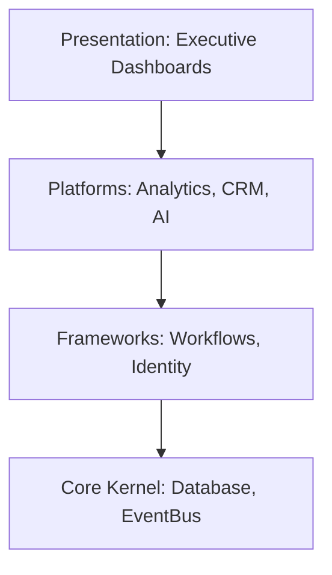

# DWIP Enterprise Master Overview
**Document ID**: DWIP-M-01 | **Version**: 1.0.0-GA | **Author**: Lead Enterprise Software Architect

## Table of Contents
1. [Vision & Objectives](#1-vision--objectives)
2. [Business Scope](#2-business-scope)
3. [Platform Overview](#3-platform-overview)
4. [Technology Stack](#4-technology-stack)
5. [Architecture & Deployment Summary](#5-architecture--deployment-summary)

---

## Revision History
| Version | Date | Author | Description |
| :--- | :--- | :--- | :--- |
| 1.0.0-GA | July 18, 2026 | Lead Architect | Initial consolidation for GA release. |

---

## Related Documents
* [docs/master/02_Business_Architecture.md](file:///c:/Users/arhaa/.gemini/antigravity-ide/scratch/remix-workshop-management-system/docs/master/02_Business_Architecture.md)
* [docs/master/03_System_Architecture.md](file:///c:/Users/arhaa/.gemini/antigravity-ide/scratch/remix-workshop-management-system/docs/master/03_System_Architecture.md)

---

## 1. Vision & Objectives
The Dealer Workshop Integration Platform (DWIP) is an enterprise-grade digital core designed to automate, optimize, and forecast complex automotive repair operations and financial programs. It integrates workflow telemetry, Annual Maintenance Contracts (AMC), Warranty processing, Field Service Bulletins (FSB), customer interaction CRM pipelines, and predictive AI decision models.

## 2. Business Scope
* **Operations**: Streamlining vehicle reception, bay allocation, technician assignments, and billing.
* **Financial Programs**: Automating allocations of parts, labor claims, policy renewals, and campaign targeted selections.
* **Intelligence**: Providing real-time CSI metrics, parts consumption forecasts, and delay risks warnings.

## 3. Platform Overview
The DWIP platform utilizes a strictly decoupled, layered architecture to maintain high performance and database isolation:

## 4. Technology Stack
* **Runtime**: Node.js v18 LTS
* **Framework**: Express for API services
* **ORM/Storage**: MySQL/PostgreSQL with Drizzle ORM, backed by local JSON synchronisation.
* **Telemetry**: EventBus outbox pattern.
* **AI Model Engine**: Google GenAI SDK.
* **Testing**: Vitest Runner.

## 5. Architecture & Deployment Summary
Deployments are containerized using Docker, allowing standard multi-region rollouts. Secrets and credentials are managed strictly via environment parameter variables.
