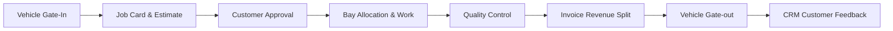

# DWIP Business Architecture
**Document ID**: DWIP-M-02 | **Version**: 1.0.0-GA | **Author**: Lead Business Architect

## Table of Contents
1. [End-to-End Service Lifecycle](#1-end-to-end-service-lifecycle)
2. [Workflows & Core Categories](#2-workflows--core-categories)
3. [CRM, Analytics & Reporting Integration](#3-crm-analytics--reporting-integration)

---

## Revision History
| Version | Date | Author | Description |
| :--- | :--- | :--- | :--- |
| 1.0.0-GA | July 18, 2026 | Lead Architect | Initial consolidation for GA release. |

---

## Related Documents
* [docs/master/01_Enterprise_Overview.md](file:///c:/Users/arhaa/.gemini/antigravity-ide/scratch/remix-workshop-management-system/docs/master/01_Enterprise_Overview.md)
* [docs/master/05_ER_Diagrams.md](file:///c:/Users/arhaa/.gemini/antigravity-ide/scratch/remix-workshop-management-system/docs/master/05_ER_Diagrams.md)

---

## 1. End-to-End Service Lifecycle
DWIP coordinates the dealership journey from reception to customer feedback:

## 2. Workflows & Core Categories
* **Retail & Paid Service**: Standard customer-paid maintenance, calculating technician splits.
* **Warranty Processing**: Automatically triggers when parts are tagged as warranty-covered, validating claims before routing to OEM.
* **AMC Maintenance**: Deducts parts/labor costs based on active AMC policy limits.
* **Field Service Bulletin (FSB)**: Campaigns targeting specific recall VIN ranges.
* **Breakdown Service**: Out-of-station site towing and resolution telemetry tracking.

## 3. CRM, Analytics & Reporting Integration
Every transaction publishes domain events that update the Customer 360 profile, update aggregated facts in the Analytics metrics databases, and update executive dashboard layouts.
