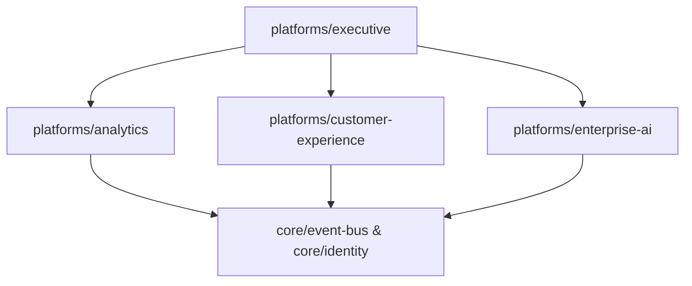

# DWIP System Architecture
**Document ID**: DWIP-M-03 | **Version**: 1.0.0-GA | **Author**: Lead System Architect

## Table of Contents
1. [Layered Architecture Mappings](#1-layered-architecture-mappings)
2. [Module Registry & Subsystem Boundaries](#2-module-registry--subsystem-boundaries)
3. [Subsystem Dependencies](#3-subsystem-dependencies)

---

## Revision History
| Version | Date | Author | Description |
| :--- | :--- | :--- | :--- |
| 1.0.0-GA | July 18, 2026 | Lead Architect | Initial consolidation for GA release. |

---

## Related Documents
* [docs/master/01_Enterprise_Overview.md](file:///c:/Users/arhaa/.gemini/antigravity-ide/scratch/remix-workshop-management-system/docs/master/01_Enterprise_Overview.md)
* [docs/master/04_Database_Architecture.md](file:///c:/Users/arhaa/.gemini/antigravity-ide/scratch/remix-workshop-management-system/docs/master/04_Database_Architecture.md)

---

## 1. Layered Architecture Mappings
The DWIP system operates in five isolated logic layers:
1. **Presentation (Executive)**: Renders role-based dashboard widgets (CEO, General Manager).
2. **Intelligence (Analytics, CRM, AI)**: Compiles Customer 360 profiles, evaluates metrics aggregates, and forecasts revenues.
3. **Application & Workflows**: Registers strategies and validates lifecycle rules.
4. **Foundation (Identity, Telemetry)**: Manages RBAC permission filters and event listening registries.
5. **Kernel (Core)**: Handles database pool queries, TransactionManager rollbacks, and EventBus outbox flushing.

## 2. Module Registry & Subsystem Boundaries
Subsystems communicate using immutable DTOs and event-driven signals, preventing tight circular dependencies:

## 3. Subsystem Dependencies
All layers consume the read-only contracts defined in the Core Kernel layer to verify transaction safety.
