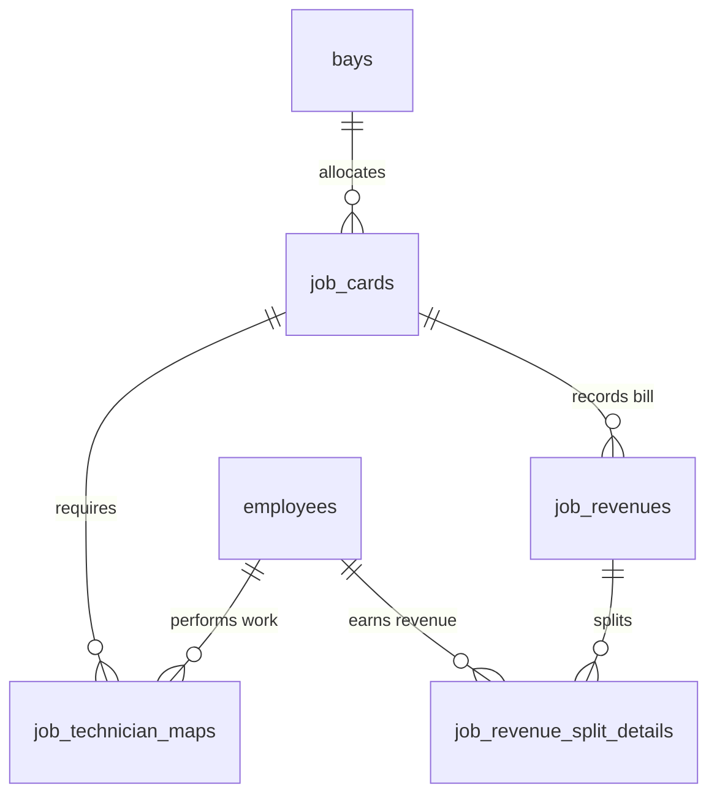
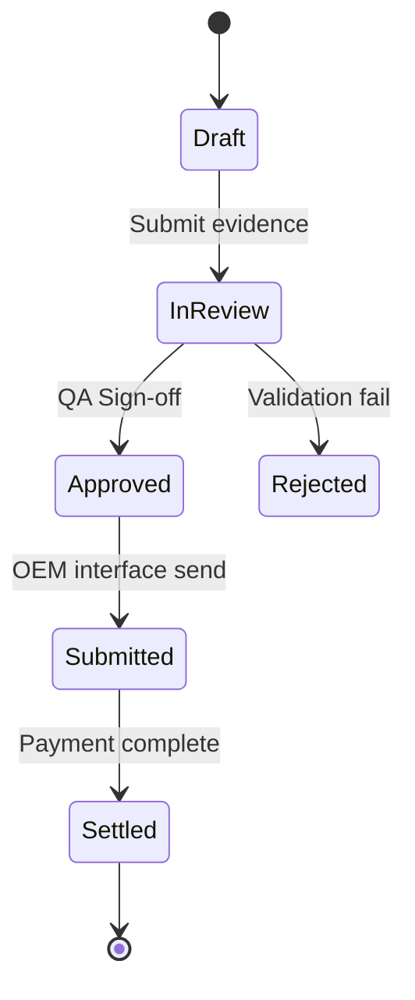
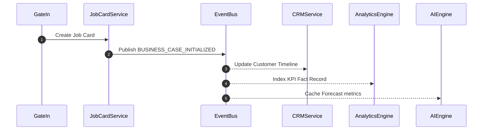

# DWIP Entity-Relationship & Workflow Diagrams
**Document ID**: DWIP-M-05 | **Version**: 1.0.0-GA | **Author**: Lead Database Designer

## Table of Contents
1. [Entity Relationships](#1-entity-relationships)
2. [Workflow State Machine Transition Path](#2-workflow-state-machine-transition-path)
3. [Service Lifecycle Diagram](#3-service-lifecycle-diagram)

---

## Revision History
| Version | Date | Author | Description |
| :--- | :--- | :--- | :--- |
| 1.0.0-GA | July 18, 2026 | Lead Architect | Initial consolidation for GA release. |

---

## Related Documents
* [docs/master/04_Database_Architecture.md](file:///c:/Users/arhaa/.gemini/antigravity-ide/scratch/remix-workshop-management-system/docs/master/04_Database_Architecture.md)

---

## 1. Entity Relationships

## 2. Workflow State Machine Transition Path

## 3. Service Lifecycle Diagram

